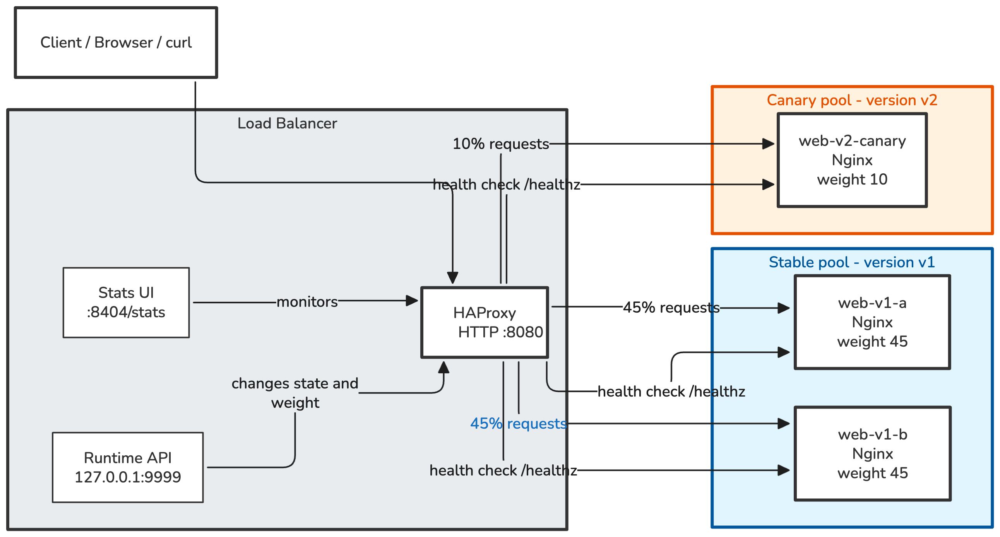

# HAProxy Canary Lab

A lightweight, practical project demonstrating HAProxy concepts including load balancing, active health checks, canary deployments, and dynamic configuration via the Runtime API.

## Project Purpose
To demonstrate how HAProxy operates as an HTTP reverse proxy and load balancer in a minimal Docker Compose environment, focusing on operational tasks like node maintenance and traffic shifting without complex application frameworks or orchestration tools.

## Architecture Diagram

## Prerequisites
* Docker
* Docker Compose
* `curl`
* `make` (optional, for convenience commands)
* `nc` or `socat` (for Runtime API, `nc` is available on most systems)

## How to Start the Lab
1. Run `make up` (or `docker compose up -d`).
2. Access the application at `http://localhost:8080`.
3. Access the statistics page at `http://localhost:8404`.

## How to Validate the HAProxy Configuration
Run `make validate` (or `docker compose run --rm haproxy haproxy -c -f /usr/local/etc/haproxy/haproxy.cfg`).

## How to Send Test Requests
Run `make test` (or `curl -s -i localhost:8080`). Note the `X-Backend-Server` response header which shows the backend node that served the request.

---
*Note: This project is being developed in phases. Further documentation, shell scripts, and advanced scenarios will be added in upcoming phases.*
